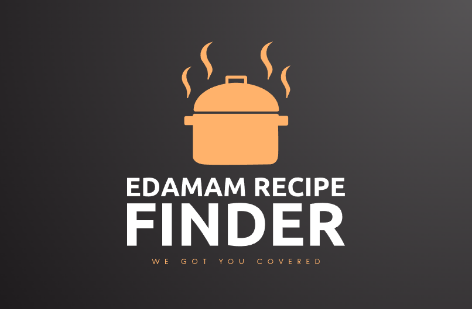
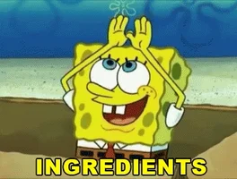
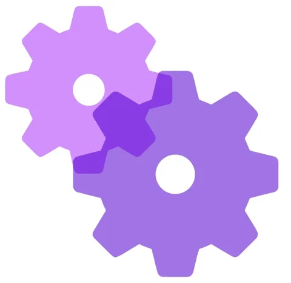
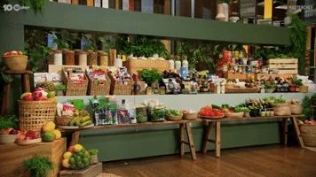

# Welcome to the Edamam recipe finder!
## Don't let picking your next meal waste your time let Edamam do the hard work for you.

<a href="#introduction">Introduction</a> | <a href="#main-features">Main Features</a> | <a href="#clone-the-repository">Clone the Repository</a> | <a href="#database-setup">Database Setup</a> | <a href="#Final_Words">Final Words</a> | <a href="#Created_by">Created by</a> | 
<a href="#license">License</a>  

## Introduction

Welcome to Edamam recipe finder, taking the hassle out of finding the perfect recipe for any occassion.
Need to exclude certain things? We got you covered limit your search specifically to your dietary requirements.
With so much choice you can tailor your choice to whatever you fancy and Edamam does the hard work for you.
End of the month and need to figure out a meal with what you have in the house? Our favourite feature you can add ingredients you currently have and Edamam will give you a selection of suitable recipes.
### DISCLAIMER We know you will find so many new amazing recipes but please only cook one at a time!

---

### Main Features:

⭐Recipe finder API

⭐The available input options:

⭐Ingredients

⭐Dietary Options

⭐Dietary Need

⭐Shows Weight

⭐Shows Calories

⭐Additional choices similar to 1st choice

---

### clone-the-repository:

Feel free to clone this project and see how I set it all up, this was my first python project on my path into tech.\
To achieve this I took part in the 
[🩷**Code First Girls**🩷](https://codefirstgirls.com/) Python kickstarter course, its free to sign up for and the mountain of experience I gained it was well worth the wait for a space on this amazing free course!

My Edamam project recieved 🩷**Best in Class**🩷 an achievement I am very proud of especially as this is my very first python exposure to tech.

---

### Database Setup:

- Go to the website [edamam](https://www.edamam.com/)
- Create an account and select developer option for free 
- Click on accounts in the top left of main page and then navigate to your dashboard.
- Click on applications tab
- You will then see your recipe search API click on the view button
- You will then see your API ID and your API key which you will need to add into the python script to be able to run the program.

 

---

### Final Words:

This was a really interesting project and i really enjoyed learning the fundamentals of python and the use of API's

Creating a functional app was a great achievement for me and I'm looking forward to developing my skills so i can expand on projects like this to combine multiple elements such as databases and a front end in future projects.

---

### Created by:

This project was created by Jessica Brown
I would like to take the time to thank Code First Girls for the Python kickstarter course and my instructor Mia for teaching me the fundamentals of Python so i could achieve what i have in this project.

🩷Please feel free to follow me on linkedin 🩷

[LinkedIn](https://www.linkedin.com/in/jb232020)

---

### License:

[text](LICENSE)
